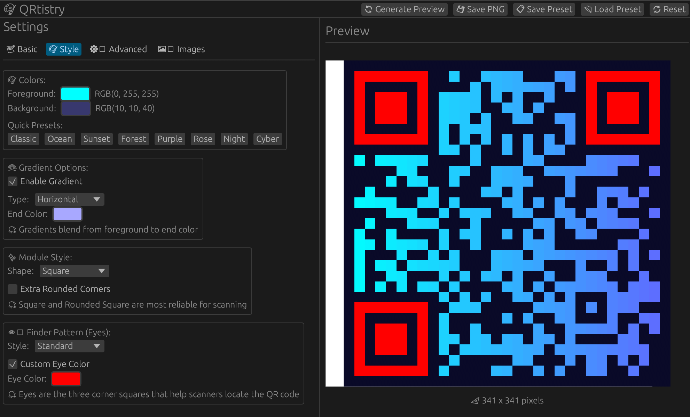

# 🎨 QRtistry

> **A professional, feature-rich GUI application for creating beautifully customized QR codes with real-time preview and advanced styling options.**

Create and transform ordinary QR codes into stunning, branded designs with gradients, custom shapes, logo overlays, and artistic backgrounds. Built with Rust for maximum performance and reliability.



Date: 16 December 2025

[Oliver Bonham-Carter](https://www.oliverbonhamcarter.com/)

Email: obonhamcarter at allegheny.edu

[](https://opensource.org/licenses/MIT)

## Table of Contents
- [🎨 QRtistry](#-qrtistry)
  - [Table of Contents](#table-of-contents)
  - [✨ What Makes This Special?](#-what-makes-this-special)
  - [🎨 Features](#-features)
    - [Core Functionality](#core-functionality)
    - [Color Customization](#color-customization)
      - [Solid Colors](#solid-colors)
      - [Gradient Effects ✨](#gradient-effects-)
    - [Module Styles](#module-styles)
    - [Eye Customization 👁️](#eye-customization-️)
    - [Image Features 🖼️](#image-features-️)
      - [Logo Overlay](#logo-overlay)
      - [Background Images](#background-images)
    - [Advanced Options](#advanced-options)
      - [Error Correction Levels](#error-correction-levels)
      - [Transparency Control](#transparency-control)
      - [Dimensions](#dimensions)
    - [Configuration Management 💾](#configuration-management-)
  - [🚀 Quick Start](#-quick-start)
    - [Prerequisites](#prerequisites)
    - [Installation \& Setup](#installation--setup)
    - [First Time Use](#first-time-use)
  - [📖 Usage Guide](#-usage-guide)
    - [Quick Workflow Examples](#quick-workflow-examples)
    - [Understanding QR Code Capacity](#understanding-qr-code-capacity)
  - [💡 Tips for Best Results](#-tips-for-best-results)
    - [Scannability Best Practices ✅](#scannability-best-practices-)
    - [Professional Design Guidelines 💼](#professional-design-guidelines-)
    - [Creative Styling Ideas 🎨](#creative-styling-ideas-)
    - [Output Size Guidelines 📏](#output-size-guidelines-)
    - [Color Selection Tips 🎨](#color-selection-tips-)
  - [🎯 Use Cases](#-use-cases)
  - [🎨 Technical Details](#-technical-details)
  - [Platform Support](#platform-support)
  - [🚀 Advanced Usage](#-advanced-usage)
    - [Preset Files](#preset-files)
    - [Batch Processing](#batch-processing)
  - [🧪 Development \& Customization](#-development--customization)
    - [Building from Source](#building-from-source)
    - [Customizing the Code](#customizing-the-code)
    - [Debugging Tips](#debugging-tips)
  - [❓ Troubleshooting](#-troubleshooting)
    - [Common Issues \& Solutions](#common-issues--solutions)
    - [Performance Issues](#performance-issues)
    - [Getting Help](#getting-help)
  - [🚀 Potential Future Enhancements](#-potential-future-enhancements)
  - [📚 Resources](#-resources)
  - [🤝 Contributing](#-contributing)
  - [📄 License](#-license)
    - [A Work In Progress](#a-work-in-progress)


## ✨ What Makes This Special?

Unlike basic QR code generators, QRtistry offers:

- 🎨 **Professional Design Tools**: Gradients, custom eye styles, and module shapes
- 🖼️ **Image Integration**: Add logos and background images seamlessly
- ⚡ **Real-time Preview**: See changes instantly in a large, clear preview
- 💾 **Preset Management**: Save and load your favorite configurations
- 🎯 **Intuitive Interface**: Resizable panels and organized tabs for easy workflow
- 🚀 **Native Performance**: Blazing fast with Rust's efficiency

## 🎨 Features

### Core Functionality

- **Interactive Text Input**: Enter any text, URL, or data to encode
- **Real-time Preview**: See your QR code update instantly
- **High-Quality Export**: Save as PNG with customizable dimensions (128-2048px)
- **Tabbed Interface**: Organized controls across Basic, Style, Advanced, and Images tabs

### Color Customization

#### Solid Colors

- **Color Picker**: Choose any RGB color for foreground and background
- **8 Preset Themes**:
  - Classic (Black & White)
  - Ocean (Blue tones)
  - Sunset (Orange warmth)
  - Forest (Green nature)
  - Purple (Royal violet)
  - Rose (Pink elegance)
  - Night (Light on dark)
  - Cyber (Neon cyan)

#### Gradient Effects ✨

- **4 Gradient Types**:
  - Horizontal (left to right)
  - Vertical (top to bottom)
  - Diagonal (corner to corner)
  - Radial (center outward)
- **Dual Color**: Blend between two colors seamlessly
- **Custom gradient colors** for unique visual effects

### Module Styles

- **Square**: Classic QR code appearance
- **Circle**: Smooth circular modules
- **Rounded Square**: Softer squared edges with adjustable corner radius
- **Dots**: Minimalist dot pattern

### Eye Customization 👁️

Customize the three finder patterns (corner "eyes"):

- **Standard**: Traditional square eyes
- **Circle**: Circular eye patterns
- **Rounded Square**: Smooth rounded corners
- **Flower**: Decorative flower-like pattern
- **Diamond**: Geometric diamond shape
- **Custom Eye Color**: Different color from data modules

### Image Features 🖼️

#### Logo Overlay

- **Add logos** to the center of your QR code
- **Adjustable size** (5% to 35% of QR code)
- **Automatic centering** and sizing
- **Alpha channel support** for transparent logos
- Maintains scannability with proper error correction

#### Background Images

- **Blend QR codes** with custom background images
- **Adjustable opacity** (0% to 100%)
- **Automatic resizing** to match QR code dimensions
- Creates artistic and branded QR codes

### Advanced Options

#### Error Correction Levels

- **Low (7%)**: Smaller QR codes, less decoration tolerance
- **Medium (15%)**: Balanced approach (recommended)
- **Quartile (25%)**: Good for creative styling
- **High (30%)**: Maximum decoration and damage tolerance

#### Transparency Control

- **QR Opacity**: Control overall QR code transparency
- **Watermark mode**: Low opacity for subtle integration
- **Blending effects**: Perfect for overlays

#### Dimensions

- **Size Control**: 128px to 2048px output resolution
- **Border Control**: 0-10 modules of quiet zone
- **Module sizing**: Automatic calculation for sharp rendering

### Configuration Management 💾

- **Save Presets**: Export your custom configurations as JSON
- **Load Presets**: Quickly apply saved settings
- **Timestamp naming**: Auto-generated filenames with date/time
- **Share configurations**: Transfer settings between projects

## 🚀 Quick Start

### Prerequisites

- **Rust** (latest stable version) - [Install from rustup.rs](https://rustup.rs/)
- **Cargo** (included with Rust)
- **Operating System**: macOS, Linux, or Windows

### Installation & Setup

```bash
# Clone or navigate to the project directory
cd /path/to/qrcode_image

# Build the optimized release version (recommended)
cargo build --release

# Run the application
./target/release/qrcode_image

# Or build and run in one command
cargo run --release
```

### First Time Use

1. **Launch the Application** - The window opens at 1200×800px with an organized layout
2. **Enter Your Content** - Type text or paste a URL in the "QR Code Content" field
3. **Preview Automatically Generates** - Your QR code appears in the large central preview area
4. **Customize** (optional) - Explore the left panel tabs for styling options
5. **Save** - Click "💾 Save PNG" in the top toolbar to export your QR code

The default QR code (https://oliverbonhamcarter.com) generates automatically on startup so you can immediately see the preview functionality.


**Key Layout Features:**

- **Top Toolbar**: Quick access to all action buttons (Generate, Save PNG, Save/Load Preset, Reset)
- **Resizable Left Panel**: Drag the edge to adjust control panel width (350-600px)
- **Large Central Preview**: QR code scales dynamically to use available space (up to 800px)
- **Compact Status Bar**: Shows generation status and helpful messages
- **Organized Tabs**: Settings grouped logically by function

## 📖 Usage Guide

### Quick Workflow Examples

**Simple QR Code**: Enter text → Choose color preset → Save PNG

**Branded QR**: Enter text → Set error correction to High → Add logo (Images tab) → Adjust size to 15-20% → Save

**Artistic QR**: Enable gradient → Choose module/eye styles → Add background image → Adjust opacity → Save

### Understanding QR Code Capacity

QR codes have size limits based on content length and error correction:

- **Numeric only**: Up to 7,089 digits
- **Alphanumeric**: Up to 4,296 characters
- **Binary/Byte**: Up to 2,953 bytes
- **URLs**: Typically 200-500 characters work well

**If your QR code fails to generate**, the status bar will show an error. Try:

- Shortening your content
- Using a lower error correction level
- Removing special characters

## 💡 Tips for Best Results

### Scannability Best Practices ✅

- **High contrast is essential**: Dark foreground on light background (or vice versa)
- **Adequate border spacing**: Keep border at 2-4 modules minimum
- **Reliable error correction**: Use Medium or Quartile for standard use
- **Module style matters**: Square and Rounded Square are most reliable
- **Logo size limits**: Keep logos under 25% of QR code area
- **Test before printing**: Scan with multiple devices and apps
- **Lighting considerations**: Ensure good contrast in target environment

### Professional Design Guidelines 💼

- **Use preset themes** for instant harmonious color combinations
- **Stick to Medium error correction** for balance between size and reliability
- **Optimal sizes**: 512-1024px works for most business applications
- **Branding**: Add company logo at 15-20% size for recognition
- **Subtle gradients**: Small color differences maintain scannability
- **Consistent eye styling**: Match eye colors to your brand palette

### Creative Styling Ideas 🎨

- **Artistic modules**: Circle or Dots for unique appearance
- **High error correction**: Enables more aggressive styling
- **Custom eye colors**: Make finder patterns stand out
- **Radial gradients**: Create dynamic, eye-catching effects
- **Background images**: Blend QR with photos at 30-50% opacity
- **Decorative eyes**: Flower or Diamond styles for special occasions

### Output Size Guidelines 📏

| Use Case | Recommended Size | Notes |
|----------|-----------------|-------|
| Website/Digital | 256-512px | Fast loading, sufficient clarity |
| Social Media | 512-768px | Good for posts and profiles |
| Business Cards | 512-1024px | Minimum 512px for print quality |
| Flyers/Posters | 1024-2048px | Larger format needs higher resolution |
| Billboards | 2048px | Maximum detail for large-scale |
| Email Signatures | 256-384px | Balance size and file size |
| Mobile Apps | 512px | Good for most screen densities |

**Print Considerations:**

- Calculate based on DPI: (desired_inches × 300 DPI) = pixel size
- Example: 2-inch QR code at 300 DPI = 600px minimum
- Always test print at actual size before mass production

### Color Selection Tips 🎨

**High Contrast Combinations** (Best for scanning):

- Black on White (classic)
- Dark Blue on Light Blue
- Dark Green on Cream
- White on Dark Gray

**Avoid These Combinations**:

- Red on Green (color blindness issues)
- Yellow on White (too low contrast)
- Similar brightness values (e.g., dark blue on dark purple)
- Pure red or yellow foregrounds (some scanners struggle)

**Gradient Guidelines**:

- Ensure both gradient colors contrast with background
- Test diagonal and radial gradients more carefully
- Keep gradient color differences subtle for reliability
- High error correction helps with gradient scanning

## 🎯 Use Cases

**Business**: Business cards, marketing materials, product packaging, event tickets  
**Personal**: Wedding invitations, art projects, social media profiles, portfolios  
**Technical**: WiFi sharing (`WIFI:T:WPA;S:NetworkName;P:Password;;`), vCard contacts, app downloads

## 🎨 Technical Details

**Built With:**

- Rust 2021 Edition
- egui v0.30.0 (GUI framework)
- qrcode v0.14.1 (QR generation)
- image v0.25.5 (PNG encoding/decoding)
- rfd v0.15.1 (native file dialogs)

**Performance:**

- Preview Generation: 50-200ms
- File Export: 100-500ms
- Memory Usage: ~50-100MB
- Startup Time: <1 second

**File Formats:**

- Output: PNG (RGBA, lossless compression, sRGB)
- Presets: JSON configuration files (portable, excludes image paths)

## Platform Support

**Supported Platforms:**

- ✅ macOS 10.13+ (fully tested)
- ✅ Linux (X11/Wayland, tested on Ubuntu 20.04+, Fedora 35+, Arch)
- ⚠️ Windows 10/11 (compatible, not extensively tested)

**System Requirements:**

- RAM: 100MB minimum, 256MB recommended
- Display: 1024×768 minimum, 1920×1080 recommended
- Rust 1.70.0+ (for building from source)

## 🚀 Advanced Usage

### Preset Files

Save and share configurations as JSON:

1. Configure your style in the GUI
2. Click "📋 Save Preset"
3. Share with team members or reuse for consistent branding

### Batch Processing

For multiple QR codes with consistent styling:

1. Design base style and save as preset
2. For each QR: Load preset → Change content → Save PNG

## 🧪 Development & Customization

### Building from Source

```bash
# Clone or download the repository
git clone <repository-url>
cd qrcode_image

# Development build (faster compilation, slower runtime)
cargo build

# Release build (slower compilation, optimal performance)
cargo build --release

# Run tests (if any)
cargo test

# Check code without building
cargo check
```

### Customizing the Code

**Adding New Color Presets:**
Modify the `COLOR_PRESETS` array in [src/types.rs](src/types.rs#L211):
```rust
const COLOR_PRESETS: &[ColorPreset] = &[
    // Existing presets...
    ColorPreset { 
        name: "Your Theme", 
        fg: [R, G, B], 
        bg: [R, G, B] 
    },
];
```

**Adding New Module Styles:**

1. Add variant to `ModuleStyle` enum
2. Implement drawing logic in `draw_data_module()`
3. Add UI option in `render_style_tab()`

**Changing Default Settings:**

Modify the `Default` implementation for `QrCodeApp`:
```rust
impl Default for QrCodeApp {
    fn default() -> Self {
        Self {
            qr_text: String::from("Your default text"),
            size: 1024,  // Your preferred size
            // ... other defaults
        }
    }
}
```

### Debugging Tips

```bash
# Run with debug output
RUST_LOG=debug cargo run --release

# Run with backtrace on panic
RUST_BACKTRACE=1 cargo run

# Profile build times
cargo build --release --timings
```

## ❓ Troubleshooting

### Common Issues & Solutions

**Issue: QR Code Won't Generate**

- ✅ Check content length - may exceed QR code capacity
- ✅ Try lower error correction level (Low or Medium)
- ✅ Remove special characters or emoji
- ✅ Check status bar for specific error message

**Issue: QR Code Won't Scan**

- ✅ Ensure high contrast between colors
- ✅ Increase border size to 3-4 modules
- ✅ Use Square or Rounded Square module style
- ✅ Reduce logo size or remove logo
- ✅ Disable gradient or use subtle gradient
- ✅ Test with multiple scanning apps
- ✅ Ensure adequate lighting when scanning

**Issue: Preview Appears Blurry**

- ✅ Increase output size (larger pixel dimensions)
- ✅ Window may be scaled - preview shows actual pixels
- ✅ Export PNG will be sharp at specified resolution

**Issue: Colors Look Different After Export**

- ✅ This is normal - PNG uses sRGB color space
- ✅ Preview may have slight gamma differences
- ✅ View exported PNG in image viewer to verify

**Issue: Logo Doesn't Appear**

- ✅ Ensure logo file is PNG or JPG
- ✅ Check logo size slider is above 5%
- ✅ Regenerate preview after loading logo
- ✅ Try increasing error correction to High

**Issue: Application Won't Start**

- ✅ Verify Rust installation: `rustc --version`
- ✅ Rebuild: `cargo clean && cargo build --release`
- ✅ Check system graphics drivers
- ✅ Try running from terminal to see error messages

**Issue: File Dialogs Don't Open**

- ✅ Grant file system permissions (macOS Security settings)
- ✅ Run from terminal rather than double-click
- ✅ Check file dialog library (rfd) compatibility

**Issue: Preset Won't Load**

- ✅ Verify JSON file is valid (not corrupted)
- ✅ Check file was saved from same version
- ✅ Try re-saving preset with current version

### Performance Issues

**Slow Preview Generation:**

- Large sizes (1024px+) take longer - this is normal
- Complex gradients add computation time
- Logo/background images require processing
- Release build is significantly faster than debug

**High Memory Usage:**

- Large images (2048px) use more RAM
- Multiple background images in memory
- Close and reopen app to clear memory

### Getting Help

If you encounter issues not covered here:
1. Check the error message in the status bar
2. Run from terminal to see detailed output
3. Try with default settings (click Reset button)
4. Verify Rust and dependencies are up to date
5. Check GitHub issues or create a new one

## 🚀 Potential Future Enhancements

- SVG/PDF export formats
- Batch processing from CSV
- Dark mode UI
- vCard/WiFi/Calendar templates
- Command-line interface
- Animated QR codes (GIF)

See issues for planned features and contribute ideas!

## 📚 Resources

- [ISO/IEC 18004:2015](https://www.iso.org/standard/62021.html) - QR Code specification
- [Rust Book](https://doc.rust-lang.org/book/) - Rust programming guide
- [egui Documentation](https://docs.rs/egui/) - GUI framework reference

## 🤝 Contributing

Contributions welcome!

- 🐛 Report bugs with detailed reproduction steps
- 💡 Suggest features with use cases
- 📝 Improve documentation
- 🔧 Submit code (fork → branch → PR)

**Development**: Follow Rust formatting (`cargo fmt`), test on multiple platforms, update docs

## 📄 License

MIT License - Free for personal, commercial, and educational use. See LICENSE file.

**Built with**: egui, qrcode, image-rs, rfd

---

### A Work In Progress

Check back often to see the evolution of the project!! This project is a work-in-progress. Updates will come periodically.

If you would like to contribute to this project, **then please do!** For instance, if you see some low-hanging fruit or task that you could easily complete, that could add value to the project, then I would love to have your insight.

Otherwise, please create an Issue for bugs or errors. Since I am a teaching faculty member at Allegheny College, I may not have all the time necessary to quickly fix the bugs. I welcome the OpenSource Community to further the development of this project. Much thanks in advance.

If you appreciate this project, please consider clicking the project's _Star_ button. :-)

---

<div align="center">

**QRtistry v0.2.0** • Made with Rust 🦀 and egui

</div>
